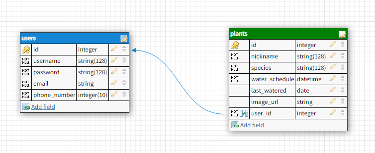

# water-my-plants-backend
Backend for water-my-plants-2

# Initializing the Project
## Requirements: Postman

1) Install Postman.
2) Create a "New Request".
3) Select a "GET" request for now.
4) Use `localhost:4000` for the address.
5) OR if you are using Heroku, use this link for the address instead - "".
6) Send the request.
7) You should get the message "welcome to the danger zone!".

# Users
## Register and Login

JSON requirements for users:
```
{
  "username": "username",
  "password": "password",
  "email": "email@email.com",
  "phone_number": "XXXXXXXXXX"
}
```

1) At the end of `localhost:4000` (or the Heroku link "") in your address, put `api/auth` to use authorization for these routes. For example `localhost:4000/api/auth`.
For all of the following instructions you may replace `localhost:4000` with the Herokuu link if you want to use the hosted server.

## To Register

2) Select "POST" as the request.
3) The address should be `localhost:4000/api/auth/register`. This is your registration endpoint.
4) Under "Body" choose the "JSON" format in which you will register with. The JSON format should look similar to the following -
```
{
  "username": "Enter username here",
  "password": "Enter password here",
  "email": "Enter email here",
  "phone_number": "Enter phone number here"
}
```
5) Send that "POST" request and you will get back JSON information with an `id` included. You are now added as a user to the database.

## To Login

7) Right click that registration request and duplicate it. In the address bar of the duplicated request, remove `register` and replace it with `login`. For example - `localhost:4000/api/auth/login`. Delete email and phone_number from the JSON object in the body.
8) Send this "POST" request. You will be logged in and a message will be returned - "Logged in! Welcome "username"!" and a "token".
9) Inside the quotes for the "token" value is your authorization, copy that entire string.
10) Click on the headers tab, and add a new header. The header must be called
`Authorization`. And the value must be your `Token` string.

## To View Existing Users

1) Duplicate this last request, which will in turn duplicate the `Authorization` header with the `Token` string that you added previously. If there is no token, the server will respond with an error. Tokens last 24 hours after a login.
2) Change the address to `localhost:4000/api/users` to recieve back ALL users, or `localhost:4000/api/users/:id` (Where `:id` is the id of the user) to get back a specific user with that Id.
3) Change the request back to a "GET" and send the request to recieve the JSON information back. 

## Updating the User

1) Using a "PUT" request to the address of `localhost:4000/api/users/:id`, you would select a user by its id, and use the following JSON information to update the existing user.
```
{
  "username": "Updated username here",
  "password": "Updated password here",
  "email": "Updated email here",
  "phone_number": "Updated phone number here"
}
```
2) Your updates will be shown in the return preview window in Insomnia

## Deleting the User

1) Using a "DELETE" request to the address of `localhost:4000/api/users/:id` you would select a user by its id, and send the "DELETE" request. 
2) That user is should now be deleted from the database.

# Plants

1) Send a "GET" request to `localhost:4000/api/plants` to access all of the plants in the database. You may also speicify an `Id` at the end to get a specific plant back. You can also use a specified Id to make a "DELETE" request to that plant.

2) To update or add a new plant you will need to use "POST" or "PUT" as before but with the following JSON data -
```
{
	"nickname": "Enter nickname here",
	"species": "Enter species here",
  "water_schedule": "Enter water schedule here in this format of for date and time - YYYY-MM-DD HH:MM"
}
```

## Get All Plants for a Specific User

1) Send a "GET" request to `localhost:4000/api/users/:id/plants` where id is the specified user you want to get a list of plants for.

# All Endpoints in Postman

GET `localhost:4000`

POST `localhost:4000/api/auth/register`
POST `localhost:4000/api/auth/login`

GET `localhost:4000/api/users`
GET `localhost:4000/api/users/:id`
PUT `localhost:4000/api/users/:id`
DELETE `localhost:4000/api/users/:id`
GET `localhost:4000/api/users/:id/plants`
POST `localhost:4000/api/users/:id/plants`

GET `localhost:4000/api/plants`
GET `localhost:4000/api/plants/:id`
PUT `localhost:4000/api/plants/:id`
DELETE `localhost:4000/api/plants/:id`

# Database Setup for Journal / Exercises

